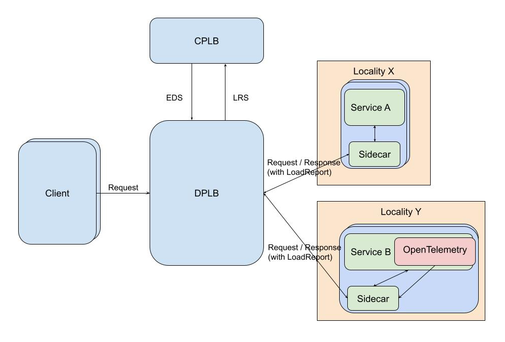
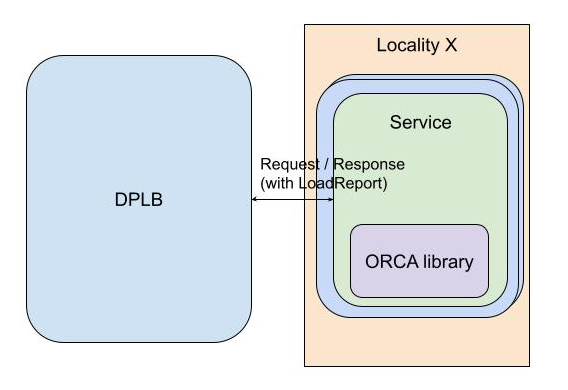

ORCA Specification
====

Last Updated: May 18, 2026

Harvey Tuch, Mark Roth, Misha Efimov, Andres Guedez

*NOTE: this is a continously updated ORCA specification based on Harvey's [original
specification](https://docs.google.com/document/d/1NSnK3346BkBo1JUU3I9I5NYYnaJZQPt8_Z_XCBCI3uA/edit?tab=t.0#heading=h.xgjl2srtytjt).*

# Overview

Simple load balancing decisions can be made by taking into account local or global
knowledge of a backend’s load, for example CPU. More sophisticated load balancing decisions are
possible with application specific knowledge, e.g. internal queue depths, or by combining multiple
application and/or hardware resource metrics.

This is useful for services that may be resource constrained along multiple dimensions (e.g. both
CPU and memory may become bottlenecks, depending on the applied load and execution environment, it’s
not possible to tell which upfront) and where these dimensions do not slot within predefined
categories (e.g. the resource may be “number of free threads in a pool”, disk IOPS, etc.).

This document provides a specification for an open standard for request cost aggregation and
reporting by backends and the corresponding utilization of such reports by data plane load balancers (such
as Envoy or gRPC). Within scope is the wire format, backend report collection mechanisms,
and backend-to-load-balancer propagation. Outside of the scope of this document are the specific LB
algorithms for working with aggregated data (such as client-side Weighted Round Robin) and the mechanics of
how those balancing decisions are delivered or calculated unless specified.

# Background

Data plane load balancers (DPLBs), for example an Envoy proxy or gRPC client,
receive HTTP or gRPC requests from clients, make LB decisions, and proxy the request and
corresponding response to/from backends. To make optimal load balancing decisions—such as
Weighted Round Robin (WRR)—the DPLB needs to have real-time utilization or query cost metrics
reported by either the endpoint or the runtime infrastructure that the backend is executing on.

There are two primary models for using these metrics:

1. **Direct Endpoint-to-Client Load Balancing (e.g., Client-side WRR)**:
   The DPLB directly parses load reports returned by individual backends in responses or
   out-of-band queries. It calculates routing weights based on these metrics locally and instantly
   adjusts traffic distribution among the endpoints.

2. **Central Control Plane Integration (e.g., xDS / LRS)**:
   In a centrally managed system, DPLBs aggregate load information gathered from backends
   and report it back to a central control plane load balancer (CPLB) via LRS (Load Reporting Service).
   The CPLB, with its global visibility, leverages this data to make globally optimal locality
   or endpoint capacity allocations, delivering updated routing assignments back to DPLBs via
   EDS (Endpoint Discovery Service).

Since backends (typically VMs or containers) are implemented and deployed independently of
the DPLB, a standardized, open protocol for load reporting from backend to DPLB is crucial.
We refer to this reporting standard and its open-source reference patterns as **Open Request Cost
Aggregation (ORCA)**.

# Specification

## ORCA Load Report Format

We propose a standard format to avoid DPLB operators needing to rewrite their backends for any given
DPLB.

ORCA reports are essentially key-value pairs, with the capacity name as key (e.g. cpu, memory) and
the value a numerical quantity representing either the absolute cost (e.g. 123 bytes) or
instantaneous sample of utilization at request time (e.g. 33.58%). CPLBs do not need to consider the
semantics of the key, the LB algorithm matches opaque keys in reports with comparable named
capacities in the CPLB capacity configuration. With that in mind, there is a strong case to be made
for standardizing common capacities, since the ORCA reports may also be used by other tools (e.g.
logging, monitoring, debug) that will benefit from a zero-config approach.

We propose the following key/value pairs be the standard core metrics in ORCA:

* application\_utilization: Application-specific utilization of backend
* cpu\_utilization: CPU
utilization of backend
* mem\_utilization: Memory utilization of backend

None of the core ORCA metrics are compulsory, but when reported by a backend they must follow the
above format. Note that there is considerable complexity in providing these metrics for either ORCA,
libraries such as OpenTelemetry or individual DPLB operators who roll their own solutions, when
considering the matrix of platforms, languages and virtualization/container environments. CPU and
memory are, however, application agnostic and generally useful.

Applications may arbitrarily define additional metrics as keys and units for their corresponding
values.

ORCA reports are ultimately aggregated into ClusterStats messages in LRS reports from the L7 load
balancer to the corresponding management server.

Without prescribing wire format, the following protobuf schema provides the data model for ORCA
reports:

See https://github.com/cncf/xds/blob/main/xds/data/orca/v3/orca_load_report.proto for the source
of truth.

```
message OrcaLoadReport {
  // CPU utilization expressed as a fraction of available CPU resources. This
  // should be derived from the latest sample or measurement. The value may be
  // larger than 1.0 when the usage exceeds the reporter dependent notion of
  // soft limits.
  double cpu_utilization = 1 [(validate.rules).double.gte = 0];

  // Memory utilization expressed as a fraction of available memory
  // resources. This should be derived from the latest sample or measurement.
  double mem_utilization = 2 [(validate.rules).double.gte = 0, (validate.rules).double.lte = 1];

  // Total RPS being served by an endpoint. This should cover all services that an endpoint is
  // responsible for.
  // Deprecated -- use ``rps_fractional`` field instead.
  uint64 rps = 3 [deprecated = true];

  // Application specific requests costs. Each value is an absolute cost (e.g. 3487 bytes of
  // storage) associated with the request.
  map<string, double> request_cost = 4;

  // Resource utilization values. Each value is expressed as a fraction of total resources
  // available, derived from the latest sample or measurement.
  map<string, double> utilization = 5
      [(validate.rules).map.values.double.gte = 0, (validate.rules).map.values.double.lte = 1];

  // Total RPS being served by an endpoint. This should cover all services that an endpoint is
  // responsible for.
  double rps_fractional = 6 [(validate.rules).double.gte = 0];

  // Total EPS (errors/second) being served by an endpoint. This should cover
  // all services that an endpoint is responsible for.
  double eps = 7 [(validate.rules).double.gte = 0];

  // Application specific opaque metrics.
  map<string, double> named_metrics = 8;

  // Application specific utilization expressed as a fraction of available
  // resources. For example, an application may report the max of CPU and memory
  // utilization for better load balancing if it is both CPU and memory bound.
  // This should be derived from the latest sample or measurement.
  // The value may be larger than 1.0 when the usage exceeds the reporter
  // dependent notion of soft limits.
  double application_utilization = 9 [(validate.rules).double.gte = 0];
}
```

# Reporting

## Choosing a Reporting Model

When integrating ORCA, DPLB operators and application developers must choose between **Inline Per-Request Reporting** and **Out-of-Band (OOB) Reporting**.

* **Inline Per-Request Reporting (Recommended)**:
  * This is the recommended model for the vast majority of applications. By attaching load reports directly to response headers or trailers, load balancers receive fresh, immediate feedback for every request, which is crucial for highly responsive load balancing decisions.
  * *Query Cost Reporting*: This is the only model that makes sense for application-defined *query cost* metrics, as query cost is inherently tied to specific, individual requests.
* **Out-of-Band (OOB) Reporting**:
  * OOB reporting should be considered only for traffic patterns where per-request reports are not delivered frequently enough to keep load balancing weights fresh. Examples include clients with very sparse or bursty traffic, or applications serving mostly long-running, persistent streams.
  * *Resource Utilization*: While OOB is excellent for tracking slowly-changing background utilization (e.g., CPU, memory, generic application load), it is not suitable for query-specific costs.

## Inline Per-Request Format

With inline (per-request) reporting, load reports will be
attached to the response headers or trailers of an HTTP/gRPC stream.

The name of the header is `endpoint-load-metrics` and could include load reports in different formats,
which are determined by the prefix word of the header value.

### Binary Protobuf

For Protocol Buffers aware code, this will be a binary serialized base64 encoded OrcaLoadReport
protobuf in `endpoint-load-metrics` header with BIN prefix:

`endpoint-load-metrics: BIN CZqZmZmZmbk/MQAAAAAAAABAQg4KA2ZvbxGamZmZmZm5P0IOCgNiYXIRmpmZmZmZyT8=`

It could also be specified in the `endpoint-load-metrics-bin` header without BIN prefix:

`endpoint-load-metrics-bin: CZqZmZmZmbk/MQAAAAAAAABAQg4KA2ZvbxGamZmZmZm5P0IOCgNiYXIRmpmZmZmZyT8=`

### Native HTTP

Comma separated key-value pairs in `endpoint-load-metrics`. This is a flattened
representation of OrcaLoadReport, with the map fields elided into the top level scope by prepending
the ‘<map_name>.’:

`endpoint-load-metrics: TEXT cpu_utilization=0.3, mem_utilization=0.8, rps_fractional=10.0, eps=1,
named_metrics.custom_metric_util=0.4`

### JSON

The JSON encoding of OrcaLoadReport:

`endpoint-load-metrics: JSON {“cpu_utilization”: 0.3, “mem_utilization”: 0.8, “rps_fractional”: 10.0,
“eps”: 1, “named_metrics”: {“custom-metric-util”: 0.4}}`

## Out-of-Band (OOB)

OOB reporting involves an additional load reporting agent that does not sit in the request path.
This is periodically sampled with sufficient frequency to provide temporal association with
requests. The data plane LB may either initiate a connection to the agent or offer a gRPC service
for agents to report to:

```
// Out-of-band (OOB) load reporting service for the additional load reporting
// agent that does not sit in the request path. Reports are periodically sampled
// with sufficient frequency to provide temporal association with requests.
// OOB reporting compensates the limitation of in-band reporting in revealing
// costs for backends that do not provide a steady stream of telemetry such as
// long running stream operations and zero QPS services. This is a server
// streaming service, client needs to terminate current RPC and initiate
// a new call to change backend reporting frequency.
service OpenRcaService {
  rpc StreamCoreMetrics(OrcaLoadReportRequest) returns (stream xds.data.orca.v3.OrcaLoadReport);
}

message OrcaLoadReportRequest {
  // Interval for generating Open RCA core metric responses.
  google.protobuf.Duration report_interval = 1;
  // Request costs to collect. If this is empty, all known requests costs tracked by
  // the load reporting agent will be returned. This provides an opportunity for
  // the client to selectively obtain a subset of tracked costs.
  repeated string request_cost_names = 2;
}
```

The definition for this service can be found at
https://github.com/cncf/xds/blob/main/xds/service/orca/v3/orca.proto.

# ORCA Integration Considerations

## Sidecar

A sidecar, e.g. Envoy or some other in-container proxy process, can inject the inline ORCA header
at response completion.



The advantage of a sidecar model is that the application requires no modification (as in the example of Service A above) to report generic, host-level metrics like CPU or memory utilization, which the sidecar can determine/gather from the runtime environment.

However, a significant limitation of the sidecar model is that it cannot natively report application-specific custom metrics or query costs (e.g., database records accessed, cache misses, or internal queue depths) without explicit application-level cooperation. To report application-specific metrics in a sidecar model, the application must still integrate with a metrics/observability library (as shown in Service B above) to expose those metrics to the sidecar.

A disadvantage of this approach is that it requires changes to how DPLB operators operationally manage their backends, introducing a binary that will require upgrades and version management. This might not be a concern in a service mesh architecture where a sidecar can be taken as given.

Service B above links with an observability library such as OpenTelemetry that provides support for
custom metrics. This enables the sidecar to collect additional telemetry data for the ORCA reports.

## Library

The application will link in a library for ORCA that will assist with generating the inline response
header.



This will require DPLB operators to modify their applications to call the ORCA library and inject
the results into the HTTP response.

The library will provide an interface such as:

`std::string GetLoadReportHeaderValue(const std::unordered_map<std::string, double>& named_metrics);`

This method will combine the core metrics such as CPU and Memory (computed by the library) and,
together with the extra application-specific metrics, compute the inline ORCA response header. The
application will then be responsible for including this in its response.

# Known DPLB Implementations

## gRPC

### Repositories
* **gRPC C-core**: [grpc/grpc](https://github.com/grpc/grpc)
* **gRPC Java**: [grpc/grpc-java](https://github.com/grpc/grpc-java)
* **gRPC Go**: [grpc/grpc-go](https://github.com/grpc/grpc-go)

### Designs & gRFCs
* [gRFC A51: Custom Backend Metrics](https://github.com/grpc/proposal/blob/master/A51-custom-backend-metrics.md)
* [gRFC A58: Client-Side Weighted Round Robin Load Balancing Policy](https://github.com/grpc/proposal/blob/master/A58-client-side-weighted-round-robin-lb-policy.md)
* [gRFC A64: xDS LRS Custom Metrics Support](https://github.com/grpc/proposal/blob/master/A64-lrs-custom-metrics.md)
* [gRFC A85: Changes to xDS LRS Custom Metrics Support](https://github.com/grpc/proposal/blob/master/A85-lrs-custom-metrics-changes.md) (Implemented/Pending rollout config)

## Envoy

[Repository](https://github.com/envoyproxy/envoy/tree/main/source/common/orca)

[Design](http://docs/document/d/1gb_2pcNnEzTgo1EJ6w1Ol7O-EH-O_Ysu5o215N9MTAg?tab=t.0#heading=h.do9yfa1wlpk8)

# Possible Future Improvements

## HTTP GET/HEAD Out-of-Band Endpoint
Alternatively, an HTTP endpoint could be exposed by the load reporting server. A GET or HEAD request to this endpoint would return a response with the `endpoint-load-metrics` header that contains the load report in one of the formats listed above.

# Change History

|Date|Description|
|----|-----------|
|May 18, 2026|Addressed PR #105 review comments.|
|Oct 25, 2024|Updated specification in this document.|
|April 16, 2019|Original [specification](https://docs.google.com/document/d/1NSnK3346BkBo1JUU3I9I5NYYnaJZQPt8_Z_XCBCI3uA/edit?tab=t.0) proposed to the Envoy community.|

