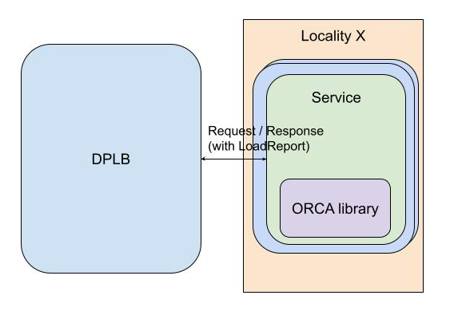

ORCA Specification
====

Last Updated: Oct 24, 2024

Harvey Tuch, Mark Roth, Misha Efimov, Andres Guedez

# Overview

Simple load balancing decisions can be made by taking into account local or global
knowledge of a backend’s load, for example CPU. More sophisticated load balancing decisions are
possible with application specific knowledge, e.g. internal queue depths, or by combining multiple
application and/or hardware resource metrics.

This is useful for services that may be resource constrained along multiple dimensions (e.g. both
CPU and memory may become bottlenecks, depending on the applied load and execution environment, it’s
not possible to tell which upfront) and where these dimensions do not slot within predefined
categories (e.g. the resource may be “number of free threads in a pool”, disk IOPS, etc.).

This document provides a specification for an open standard for request cost aggregation and
reporting by backends and the corresponding aggregation of such reports by L7 load balancers (such
as Envoy) on the data plane. Within scope is the wire format, backend report collection mechanism
and aggregation at query cost delivery time. Outside of the scope of this document are the LB
algorithms for working with aggregated data and the mechanics of how new balancing decisions are
delivered to data plane load balancers.

# Background

Data plane load balancers (DPLBs), for example an Envoy proxy or gRPC-LB client,
receive HTTP or gRPC requests from clients, make LB decisions and proxy the request and
corresponding response to/from backends. These load balancing (LB) decisions are driven by LB
assignments delivered by the control plane load balancer (CPLB) via EDS in the Universal Data Plane
API (UDPA).

The control plane can provide globally optimal decisions via greater visibility than possible in any
single DPLB instance.  DPLB’s share their load information with the control plane via LRS and in
return receive EDS assignments. It is the role of the CPLB to make intelligent load balancing
decisions as part of this control system.

Inputs to the CPLB decision making may include LRS load reports and known capacities for localities
and/or endpoints. This may be, in the simplest case, a metric such as QPS. The DPLB reports total
queries at regular time intervals via LRS, with aggregate counts attributed at locality or endpoint
granularity.

When capacity is defined with units such as CPU, memory or application-specific criteria, the DPLB
needs to have utilization or cost reported by either the endpoint or via the runtime infrastructure
that the backend is executing on.

We assume a model below where the CPLB requires from the data plane load balancer: Fixed, periodic,
load report intervals.  Total queries binned by source × destination locality delivered every (1).
Aggregate cost (in the same units as capacity) for the queries included in (2) by source ×
destination locality.

Backends providing reports are typically VMs or containers. Since these are implemented and deployed
independent of the DPLB, an open protocol for load reporting from backend to DPLB is desirable. We
refer to this reporting standard and OSS reference patterns and implementations as Open Request Cost
Aggregation (ORCA).

# Specification

## ORCA Load Report Format

We propose a standard format to avoid DPLB operators needing to rewrite their backends for any given
DPLB.

ORCA reports are essentially key-value pairs, with the capacity name as key (e.g. cpu, memory) and
the value a numerical quantity representing either the absolute cost (e.g. 123 bytes) or
instantaneous sample of utilization at request time (e.g. 33.58%). CPLBs do not need to consider the
semantics of the key, the LB algorithm matches opaque keys in reports with comparable named
capacities in the CPLB capacity configuration. With that in mind, there is a strong case to be made
for standardizing common capacities, since the ORCA reports may also be used by other tools (e.g.
logging, monitoring, debug) that will benefit from a zero-config approach.

We propose the following key/value pairs be the standard core metrics in ORCA:

* application\_utilization: Application-specific utilization of backend
* cpu\_utilization: CPU
utilization of backend
* mem\_utilization: Memory utilization of backend

None of the core ORCA metrics are compulsory, but when reported by a backend they must follow the
above format. Note that there is considerable complexity in providing these metrics for either ORCA,
libraries such as OpenTelemetry or individual DPLB operators who roll their own solutions, when
considering the matrix of platforms, languages and virtualization/container environments. CPU and
memory are, however, application agnostic and generally useful.

Applications may arbitrarily define additional metrics as keys and units for their corresponding
values.

ORCA reports are ultimately aggregated into ClusterStats messages in LRS reports from the L7 load
balancer to the corresponding management server.

Without prescribing wire format, the following protobuf schema provides the data model for ORCA
reports:

See https://github.com/cncf/xds/blob/main/xds/data/orca/v3/orca_load_report.proto for the source
of truth.

```
message OrcaLoadReport {
  // CPU utilization expressed as a fraction of available CPU resources. This
  // should be derived from the latest sample or measurement. The value may be
  // larger than 1.0 when the usage exceeds the reporter dependent notion of
  // soft limits.
  double cpu_utilization = 1 [(validate.rules).double.gte = 0];

  // Memory utilization expressed as a fraction of available memory
  // resources. This should be derived from the latest sample or measurement.
  double mem_utilization = 2 [(validate.rules).double.gte = 0, (validate.rules).double.lte = 1];

  // Total RPS being served by an endpoint. This should cover all services that an endpoint is
  // responsible for.
  // Deprecated -- use ``rps_fractional`` field instead.
  uint64 rps = 3 [deprecated = true];

  // Application specific requests costs. Each value is an absolute cost (e.g. 3487 bytes of
  // storage) associated with the request.
  map<string, double> request_cost = 4;

  // Resource utilization values. Each value is expressed as a fraction of total resources
  // available, derived from the latest sample or measurement.
  map<string, double> utilization = 5
      [(validate.rules).map.values.double.gte = 0, (validate.rules).map.values.double.lte = 1];

  // Total RPS being served by an endpoint. This should cover all services that an endpoint is
  // responsible for.
  double rps_fractional = 6 [(validate.rules).double.gte = 0];

  // Total EPS (errors/second) being served by an endpoint. This should cover
  // all services that an endpoint is responsible for.
  double eps = 7 [(validate.rules).double.gte = 0];

  // Application specific opaque metrics.
  map<string, double> named_metrics = 8;

  // Application specific utilization expressed as a fraction of available
  // resources. For example, an application may report the max of CPU and memory
  // utilization for better load balancing if it is both CPU and memory bound.
  // This should be derived from the latest sample or measurement.
  // The value may be larger than 1.0 when the usage exceeds the reporter
  // dependent notion of soft limits.
  double application_utilization = 9 [(validate.rules).double.gte = 0];
}
```

# Reporting

## Inline Per-Request Format

With inline (per-request) reporting, load reports will be
attached to the response headers or trailers of an HTTP/gRPC stream.

The name of the header is `endpoint-load-metrics` and could include load reports in different formats,
which are determined by the prefix word of the header value.

### Binary Protobuf

For Protocol Buffers aware code, this will be a binary serialized base64 encoded OrcaLoadReport
protobuf in endpoint-load-metrics header with BIN prefix:

`endpoint-load-metrics: BIN CZqZmZmZmbk/MQAAAAAAAABAQg4KA2ZvbxGamZmZmZm5P0IOCgNiYXIRmpmZmZmZyT8=`

It could also be specified in the endpoint-load-metrics-bin header without BIN prefix:

`endpoint-load-metrics-bin: CZqZmZmZmbk/MQAAAAAAAABAQg4KA2ZvbxGamZmZmZm5P0IOCgNiYXIRmpmZmZmZyT8=`

### Native HTTP

Comma separated key-value pairs in endpoint-load-metrics. This is a flattened
representation of OrcaLoadReport, with the map fields elided into the top level scope by prepending
the ‘<map_name>.’:

`endpoint-load-metrics: TEXT cpu_utilization=0.3, mem_utilization=0.8, rps_fractional=10.0, eps=1,
named_metrics.custom_metric_util=0.4`

### JSON

The JSON encoding of OrcaLoadReport:

`endpoint-load-metrics: JSON {“cpu_utilization”: 0.3, “mem_utilization”: 0.8, “rps_fractional”: 10.0,
“eps”: 1, “named_metrics”: {“custom-metric-util”: 0.4}}`

## Out-of-Band (OOB)

OOB reporting involves an additional load reporting agent that does not sit in the request path.
This is periodically sampled with sufficient frequency to provide temporal association with
requests. The data plane LB may either initiate a connection to the agent or offer a gRPC service
for agents to report to:

```
// Out-of-band (OOB) load reporting service for the additional load reporting
// agent that does not sit in the request path. Reports are periodically sampled
// with sufficient frequency to provide temporal association with requests.
// OOB reporting compensates the limitation of in-band reporting in revealing
// costs for backends that do not provide a steady stream of telemetry such as
// long running stream operations and zero QPS services. This is a server
// streaming service, client needs to terminate current RPC and initiate
// a new call to change backend reporting frequency.
service OpenRcaService {
  rpc StreamCoreMetrics(OrcaLoadReportRequest) returns (stream xds.data.orca.v3.OrcaLoadReport);
}

message OrcaLoadReportRequest {
  // Interval for generating Open RCA core metric responses.
  google.protobuf.Duration report_interval = 1;
  // Request costs to collect. If this is empty, all known requests costs tracked by
  // the load reporting agent will be returned. This provides an opportunity for
  // the client to selectively obtain a subset of tracked costs.
  repeated string request_cost_names = 2;
}
```

The definition for this service can be found at
https://github.com/cncf/xds/blob/eded343319d09f30032952beda9840bbd3dcf7ac/xds/service/orca/v3/orca.proto.

Alternatively, an HTTP endpoint can be exposed by the load reporting server. A GET or HEAD request
to this endpoint will return a response with the endpoint-load-metrics header that contains the load
report in one of the formats listed above.

# ORCA Integration Considerations

## Sidecar

A sidecar, e.g. Envoy or some other in-container proxy process, can inject the inline ORCA header
at response completion.


The advantage of a sidecar model is that the application requires no modification as in the example
service A above. A disadvantage of this approach is that it requires changes to how DPLB operators
operationally manage their backends, introducing a binary that will require upgrades and version
management. This might not be a concern in a service mesh architecture where a sidecar can be taken
as given.

Service B above links with an observability library such as OpenTelemetry that provides support for
custom metrics. This enables the sidecar to collect additional telemetry data for the ORCA reports.

## Library

The application will link in a library for ORCA that will assist with generating the inline response
header.



This will require DPLB operators to modify their applications to call the ORCA library and inject
the results into the HTTP response.

The library will provide an interface such as:

`std::string GetLoadReportHeaderValue(const std::unordered_map<std::string, double>& named_metrics);`

This method will combine the core metrics such as CPU and Memory (computed by the library) and,
together with the extra application-specific metrics, compute the inline ORCA response header. The
application will then be responsible for including this in its response.

# Known DPLB Implementations

## gRPC
TODO: [Repository]()

[Design](https://github.com/grpc/proposal/blob/master/A51-custom-backend-metrics.md)

## Envoy

[Repository](https://github.com/envoyproxy/envoy/tree/main/source/common/orca)

[Design](http://docs/document/d/1gb_2pcNnEzTgo1EJ6w1Ol7O-EH-O_Ysu5o215N9MTAg?tab=t.0#heading=h.do9yfa1wlpk8)

